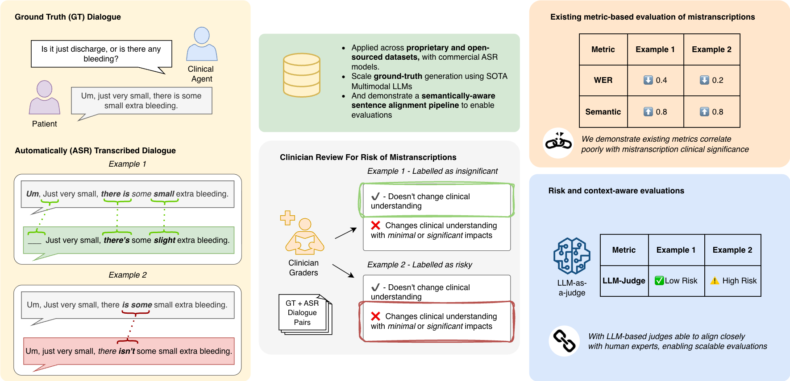

# WER is Unaware: Assessing How ASR Errors Distort Clinical Understanding in Patient-Facing Dialogue

This repository hosts the code, models, and datasets accompanying the paper. The work investigates how Automatic Speech Recognition (ASR) errors **distort clinical meaning in patient-facing dialogue** — and shows that traditional metrics like Word Error Rate (WER) fail to capture real clinical risk. The project includes scripts for aligning ground-truth utterances to ASR-generated utterances using an **LLM-based semantic aligner**, and optimizing an **LLM-as-a-Judge for clinical impact assessment** using GEPA through DSPy.

## 📝 Abstract


As Automatic Speech Recognition (ASR) is increasingly deployed in clinical dialogue, standard evaluations still rely heavily on Word Error Rate (WER). This paper challenges that standard, investigating whether WER or other common metrics correlate with the clinical impact of transcription errors. We establish a gold-standard benchmark by having expert clinicians compare ground-truth utterances to their ASR-generated counterparts, labeling the clinical impact of any discrepancies found in two distinct doctor-patient dialogue datasets. Our analysis reveals that WER and a comprehensive suite of existing metrics correlate poorly with the clinician-assigned risk labels (No, Minimal, or Significant Impact). To bridge this evaluation gap, we introduce an LLM-as-a-Judge, programmatically optimized using GEPA to replicate expert clinical assessment. The optimized judge (Gemini-2.5-Pro) achieves human-comparable performance, obtaining 90% accuracy and a strong Cohen's κ of 0.816. This work provides a validated, automated framework for moving ASR evaluation beyond simple textual fidelity to a necessary, scalable assessment of safety in clinical dialogue.

## 🔍 Overview

We introduce (available here):
- Clinician-annotated clinical-impact dataset: `llm_judge/dataset/primock_data_final_outcomes.csv`
- Semantic LLM-based aligner: `alignment/aligner/` (see `alignment/README.md` for usage)
- LLM-as-a-Judge optimized with GEPA/MIPRO: `llm_judge/` (artifacts in `llm_judge/results/`)
- Evaluations of ASR metrics (code under `alignment/scripts/` and `alignment/results/`)

## 🛠️ Environment Setup

- Install Python 3.10+ and `uv` (recommended): https://github.com/astral-sh/uv
- Install dependencies: `uv sync`
- Environment:
  - OpenRouter (default for LLM calls): `OPENROUTER_API_KEY` (required), `OPENROUTER_MODEL` optional
  - Gemini (optional): `GCP_PROJECT_ID`, `GCP_LOCATION`
  - Bedrock (optional): `AWS_REGION`

- Example: run aligner evaluation
  ```bash
  uv run python alignment/scripts/run_evaluation.py --case-id sample --asr-system demo
  ```

- Example: run judge (GEPA)
  ```bash
  uv run python -m llm_judge.cli.run_gepa \
    --data-path llm_judge/dataset/primock_data_final_outcomes.csv \
    --provider openrouter \
    --task-model meta-llama/llama-3.3-70b-instruct \
    --reflection-model anthropic/claude-4-sonnet \
    --output llm_judge/results/clinical_judge_gepa.json
  ```

## 📁 Folder Structure
- `alignment/` — semantic alignment toolkit (aligner code, scripts, sample data, sample results).
- `llm_judge/` — clinical impact judge (signatures, metrics, providers, optimizers, CLI, bundled dataset, saved judges).

### Important Files
- `alignment/data/` — example ASR transcripts and ground-truth alignments.
- `alignment/results/` — sample alignment evaluations.
- `llm_judge/dataset/` — clinical-impact dataset.
- `llm_judge/results/` — optimized judges (GEPA, MIPROv2).

## 📦 Coming Soon

- Additional dataset metadata and documentation
- Evaluations of 20+ ASR metrics, showing their poor correlation with clinical safety

## 📄 Paper

Preprint available on arXiv: https://arxiv.org/abs/2511.16544

## 📚 Citation

```bibtex
@misc{ellis2025werunawareassessingasr,
      title={WER is Unaware: Assessing How ASR Errors Distort Clinical Understanding in Patient Facing Dialogue}, 
      author={Zachary Ellis and Jared Joselowitz and Yash Deo and Yajie He and Anna Kalygina and Aisling Higham and Mana Rahimzadeh and Yan Jia and Ibrahim Habli and Ernest Lim},
      year={2025},
      eprint={2511.16544},
      archivePrefix={arXiv},
      primaryClass={cs.CL},
      url={https://arxiv.org/abs/2511.16544}, 
}
```
